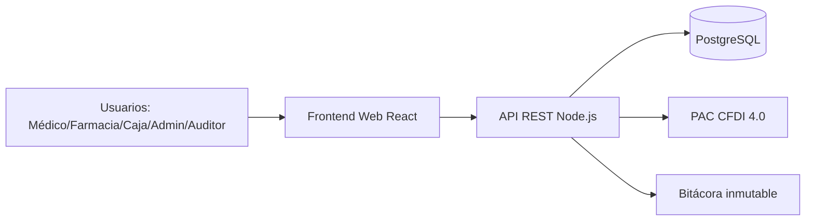

# Arquitectura Técnica SIGH

## 1. Vista de alto nivel

## 2. Capas del backend

1. **API Layer**: rutas por módulo (`/auth`, `/inventario`, `/dispensacion`, `/caja`, `/reportes`).
2. **Business Layer**: validaciones de negocio (PEPS, controlados, descuentos, corte).
3. **Data Layer**: acceso a PostgreSQL por repositorios.
4. **Audit Layer**: registro de eventos críticos append-only.

## 3. Seguridad y cumplimiento

- Autenticación con JWT firmado.
- Contraseñas con hash seguro.
- RBAC granular por módulos y acciones.
- Encriptación de datos sensibles a nivel aplicación/BD.
- Logs inmutables para auditoría.
- Diseño orientado a cumplimiento:
  - COFEPRIS (control de regulados)
  - SAT CFDI 4.0 (facturación electrónica)
  - LFPDPPP (protección de datos personales)

## 4. Escalabilidad y operación

- Soporte inicial: 10 usuarios concurrentes.
- Meta de respuesta < 3 segundos en operaciones comunes.
- Respaldo diario automático de BD.
- Monitoreo recomendado: métricas API + disponibilidad + auditoría.
